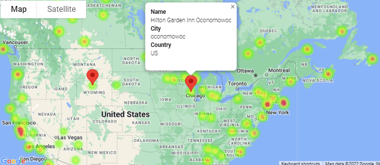
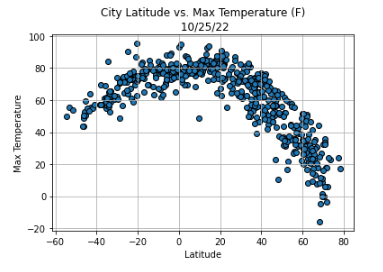
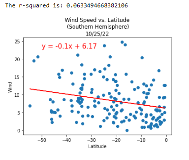

# python-api-challenge

## Overview

In this repository, the user analyzed data from over 500 cities across the world to answer the question, "What is the weather like as we approach the equator?" Using the Open Weather Map API and Google Places API the results to this question are shown below in detail. Matplotlib and gmaps were used to visualize the results of this data. 

## Analysis

Matplotlib was used to visualize the results of this data and uncover trends between latitude of cities and various variables such as maximum temperature (F), cloudiness, humidity percentage, and wind speed (mph). There are multiple scatter plots within WeatherPy that portray the relationships among latitude and previously stated variables, some including linear regression models to determine if there is a predictive value among the two variables. 

Gmaps was used to create a heat layer related to the humidity of the cities. This tool was also used to visualize hotels within a 5000 meter radius from a dataframe that portrays the perfect vacation weather (vacation_weather), resulting in only 10 cities that met specific weather parameters. 

Both tools used in conjuntion with the APIs used were valuable in uncovering trends between the various variables wihtin the datasets. 

## Observations 

There is a negative trend between maximum temperature and increasing latitude. The inverse is true for maximum temperature and decreasing latitude. This is an obvious trend as the farther away from the equator we go, the temperature continues to decrease and vice versa.

Based on the data present in thie repository, it appears that humidity percentage in the northern and southern hemisphere have little to no correlation. There are significantly less cities analyzed in the southern hemisphere within this dataset which could impact the overall results.

Similarly, there appears to be no trend between the cloudiness and relationship between city latitude in both the northern and southern hemispheres.

## Results

### Hotel Heatmap

### City Latitude vs. Max Temp
 

### Wind Speed vs. Latitude (Southern Hemisphere)
